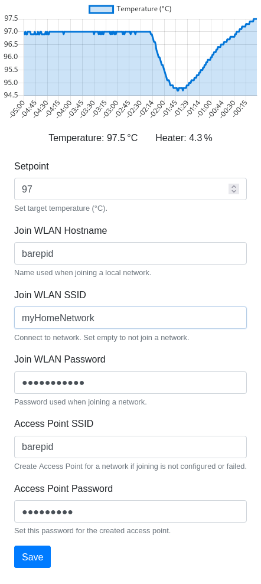

A bare PID controller for my Rancilio Silvia coffee machine.

------

I re-tailor the [ranciliopid][parent] project for my specific needs.
Relative to [ranciliopid][parent]'s feature list, I add:

- A basic web interface via HTTP.
  It enables me to control my coffee machine from other devices on the
  local network without installing apps.

I remove:

- All other ways of communication.  [ranciliopid][parent] supports IoT
technologies and has apps.
- Anything beyond the [ranciliopid][parent]'s OnlyPID scenario.
- Display and timer support.

### Screenshot

### Thanks

A big thanks goes to the [ranciliopid][parent] community. Without your
efforts and public documentation, my coffee machine would still be
controlled by the stupid old 110°C thermostat.

[parent]: https://github.com/rancilio-pid/ranciliopid
